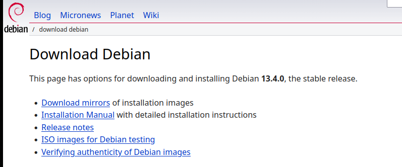
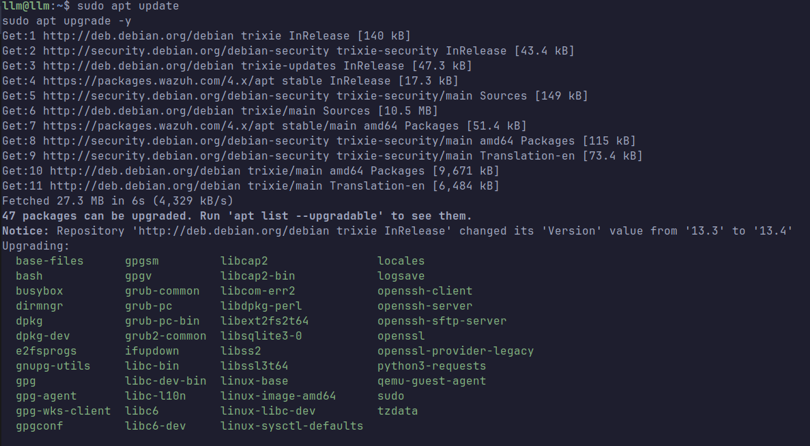

# Debian 13 Server Setup

This document describes the setup process for the base server used in the **LLM Security SOC Home Lab**.  
The server hosts the core infrastructure required for the lab environment including container runtime, development utilities, and supporting dependencies.

The environment used in this guide is **Debian 13 (Trixie)** with a minimal server installation.

Official Debian distribution page:

```url
https://www.debian.org/
```

## Environment Overview

The server can be deployed using multiple virtualization or hardware platforms such as:

• QEMU / KVM  
• VirtualBox  
• VMware  
• Bare-metal hardware  
• Cloud virtual machines

For this lab the system was deployed using **QEMU/KVM**, but the installation steps remain largely the same across different virtualization platforms.

If you need a full walkthrough of installing Debian 13 Minimal Server, the following guide can be used as a reference:
```url
https://blog.bogdancaraman.com/how-to-install-debian-13-trixie-minimal-server-cli-only-step-by-step/
```

## Base System Installation

Install **Debian 13 Minimal Server** with the following recommendations:

• Minimal installation  
• No desktop environment  
• SSH server enabled  
• Standard system utilities installed

Using a minimal installation helps keep the system lightweight and reduces unnecessary services running on the system.


## System Update

After completing the installation, update the system packages to ensure all software is running the latest stable versions.

This step prevents dependency issues later when installing additional software for the lab.

```bash
sudo apt update && sudo apt upgrade -y
```

## Required Software Installation

The following packages are required for the lab environment.

Package: curl  
Purpose: HTTP requests and API interaction

Package: docker.io  
Purpose: Container runtime used to run services for the lab

Package: docker-compose  
Purpose: Multi-container orchestration

Package: python3  
Purpose: Used for scripting and automation

Package: python3-pip  
Purpose: Python package manager

Install all required packages with the following command:
```bash
sudo apt install git curl docker.io docker-compose python3 python3-pip -y
```

## Docker Service Configuration

Enable Docker so that it automatically starts when the system boots.
```bash
sudo systemctl enable docker
```
Start the Docker service.
```bash
sudo systemctl start docker
```
Verify that the Docker service is running correctly.
```bash
sudo systemctl status docker
```

## Optional: Allow Non-Root Docker Usage

To run Docker commands without using sudo, add your user to the docker group.
```bash
sudo usermod -aG docker $USER
```
After running this command, log out and log back into the system so that the group changes take effect.


## Verification

Verify that Docker and Docker Compose are installed correctly.
```bash
docker --version  
docker compose version
```
You should see output similar to the following:

Docker version XX.X.X  
Docker Compose version X.X.X


## Next Steps

After completing the base server setup, proceed with the following lab components:

1. Install and configure **Ollama**
2. Deploy **Open WebUI**
3. Configure the **LLM logging pipeline**
4. Create **LLM attack simulations**
5. Implement **SOC detection rules for LLM threats**
