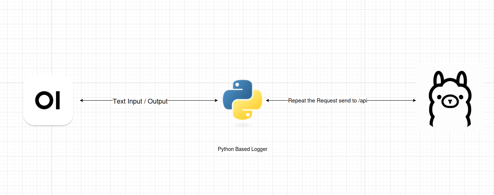
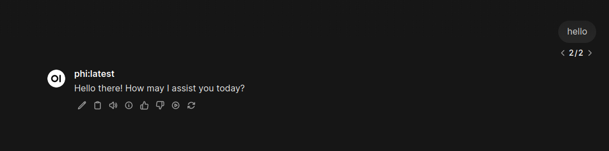

# LLM Logging Pipeline (Request Monitoring & SIEM Integration)

This section describes how to implement a **logging proxy pipeline** for monitoring LLM interactions within the lab environment.

The pipeline captures all requests and responses between **Open WebUI** and **Ollama**, enabling:

• Full visibility into prompt activity  
• Detection of malicious or abnormal usage  
• Integration with SIEM tools such as **Wazuh**  

## Architecture Overview



The logging pipeline introduces a **Flask-based proxy** between the frontend and the LLM backend.

### Data Flow

1. User sends prompt via Open WebUI  
2. Request is routed to the logging proxy  
3. Proxy forwards request to Ollama  
4. Response is returned through proxy  
5. Request + response are logged to disk  

## Components

• **Open WebUI**  
Browser-based interface for interacting with LLM models  

• **Logging Proxy (`llm_logger.py`)**  
Intercepts API traffic and records activity  

• **Ollama Backend**  
Processes LLM requests  

• **Log Storage**  
`/var/ossec/logs/llm.log` (Wazuh-compatible path)

### Security Considerations

• The script requires root privileges to write into /var/ossec/logs
• Current permissions are permissive (lab environment only)
• Flask development server is not production-safe

For production deployments:

• Use Gunicorn / uWSGI
• Restrict file permissions
• Add authentication or access control to the proxy

## Deploy Logging Pipeline

### Run Open WebUI Through Proxy

Modify the Open WebUI container to point to the logging proxy instead of Ollama directly.

```bash
docker run -d \
  --name open-webui \
  -p 3000:8080 \
  --add-host=host.docker.internal:host-gateway \
  -e OLLAMA_BASE_URL=http://host.docker.internal:5000 \
  ghcr.io/open-webui/open-webui:main
```


### Next Steps
- [x] Install and configure Ollama
- [x] Deploy Open WebUI
- [x] Configure the LLM logging pipeline
- [ ] Deploy **Wazuh SIEM**  
- [ ] Create LLM attack simulations
- [ ] Implement SOC detection rules for LLM threats
