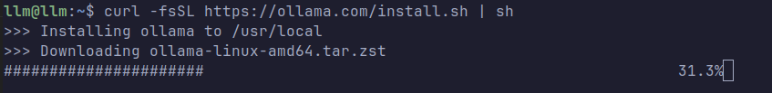
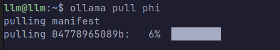

# Ollama Installation (Local LLM)

This section describes how to install and configure **Ollama** for running local Large Language Models (LLMs) within the lab environment.

Ollama allows models to run directly on the local system without requiring external APIs. This is useful for security research environments where prompt logging, attack simulation, and detection engineering need full visibility into model interactions.

Official website:
```url
https://ollama.com/
```

## Install Ollama

Install Ollama using the official installation script.

```bash
curl -fsSL https://ollama.com/install.sh | sh
```



After the installation completes, the Ollama binary and service will be available on the system.


## Start the Ollama Service

Start the Ollama server so that it can accept requests from local applications such as Open WebUI or API clients.
```bash
ollama serve
```
The service will begin listening locally and will load models when requested.


## Test the Installation

To confirm that Ollama is working correctly, run a small test model.
```bash
ollama run tinyllama
```
If the model is not already present, Ollama will automatically download it before executing the prompt interface.


## Pull Models for the Lab Environment

For this lab environment several lightweight models are used. These models are suitable for systems with limited hardware resources while still allowing testing of LLM attacks and detection mechanisms.

Pull the models using the following commands.


```bash
ollama pull tinyllama      # ~637 MB  
ollama pull phi            # ~1.6 GB  
ollama pull deepseek-coder:1.3b   # ~776 MB
```
These models provide a mix of:

• General conversational capability  
• Lightweight reasoning  
• Code generation functionality  

This allows different types of prompt attacks and testing scenarios within the lab.


## Verify Installed Models

To list all locally installed models run:
```bash
ollama list
```
Example output may include:
```models
tinyllama  
phi  
deepseek-coder:1.3b
```

## Notes

Running LLMs locally allows full control over:

• Prompt logging  
• Response logging  
• Attack simulation  
• Detection engineering  

This is essential for building a **LLM Security Monitoring Lab** aligned with the **OWASP Top 10 for LLM Applications**.
