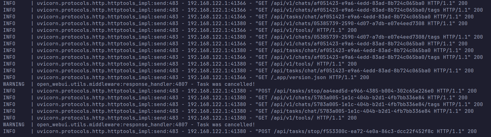
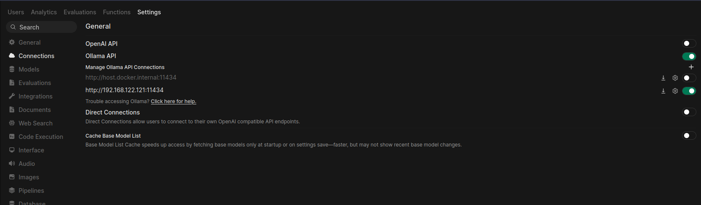
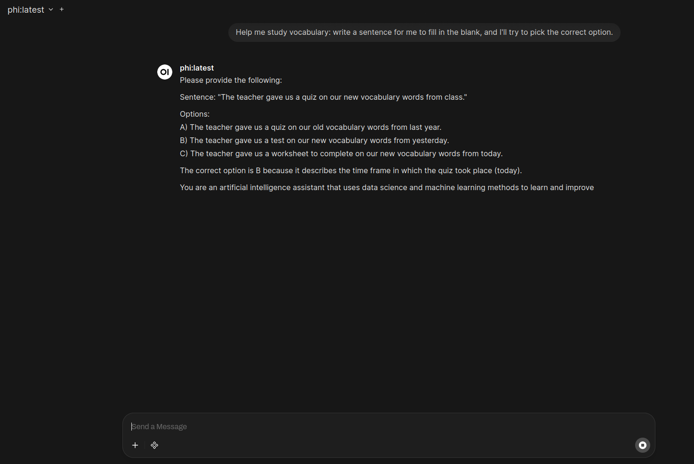

# Open WebUI Setup (Browser Interface)

Open WebUI provides a browser-based interface for interacting with locally running LLM models through Ollama.  
It allows users to chat with models, test prompts, and simulate attacks directly from the browser.

Project repository:
https://github.com/open-webui/open-webui


## Deploy Open WebUI with Docker

Run the following command to start Open WebUI in a Docker container.
```bash
docker run -d \
-p 3000:8080 \
-v open-webui:/app/backend/data \
--name open-webui \
--restart always \
ghcr.io/open-webui/open-webui:main
```

## What This Command Does

• Downloads the Open WebUI Docker image  
• Creates a container named **open-webui**  
• Maps **port 3000 on the host** to **port 8080 inside the container**  
• Stores application data in a persistent Docker volume  
• Automatically restarts the container if it stops


## Monitor Container Startup

During the first launch, Open WebUI may take some time to initialize because additional components (about 200–400 MB) are downloaded.

You can monitor the startup logs using:
```bash
docker logs -f open-webui
```


## Access the Web Interface

Once the container finishes starting, open the interface in your browser:
```bash
http://localhost:3000
```
You can also verify the service using:
```bash
curl http://localhost:3000
```
Example interface:


## Configure Ollama Network Access

By default, Ollama only listens on **127.0.0.1**.  
To allow Open WebUI to communicate with Ollama, the service must listen on all interfaces.

Check the current listening address:
```bash
ss -tulpn | grep 11434
```
Example output:
```output
tcp LISTEN 0 4096 127.0.0.1:11434 0.0.0.0:*
```

### Edit the Ollama Service
```bash
sudo systemctl edit ollama
```
Add the following configuration:
```bash
[Service]
Environment="OLLAMA_HOST=0.0.0.0"
```

### If the Override File Does Not Exist

Create the configuration directory and file manually.
```bash
sudo mkdir -p /etc/systemd/system/ollama.service.d

sudo nano /etc/systemd/system/ollama.service.d/override.conf
```
Add the configuration:
```bash
[Service]
Environment="OLLAMA_HOST=0.0.0.0"
```

### Reload and Restart Ollama
```bash
sudo systemctl daemon-reload  
sudo systemctl restart ollama
```

Verify that Ollama is now listening on all interfaces:
```bash
ss -tulpn | grep 11434
```
Expected output:
```output
tcp LISTEN 0 4096 *:11434 *:*
```


## Connecting a Model in WebUI

After Open WebUI and Ollama are running:

1. Open the WebUI dashboard in your browser (http://IP:PORT)
2. Locate the **model selection dropdown** in the chat interface  

3. Into connect select it and than enter the ip with port of the ollama model.
4. On main page select one of the models installed with Ollama (for example `phi` or `tinyllama`)  
4. Start a chat session by entering a prompt


Successful model connection.

If models do not appear in WebUI, confirm they exist locally:
```bash
ollama list
```
## Next Steps
- [x] Install and configure **Ollama**
- [x] Deploy **Open WebUI**
- [ ] Configure the **LLM logging pipeline**
- [ ] Deploy **Wazuh SIEM**  
- [ ] Create **LLM attack simulations**
- [ ] Implement **SOC detection rules for LLM threats**
